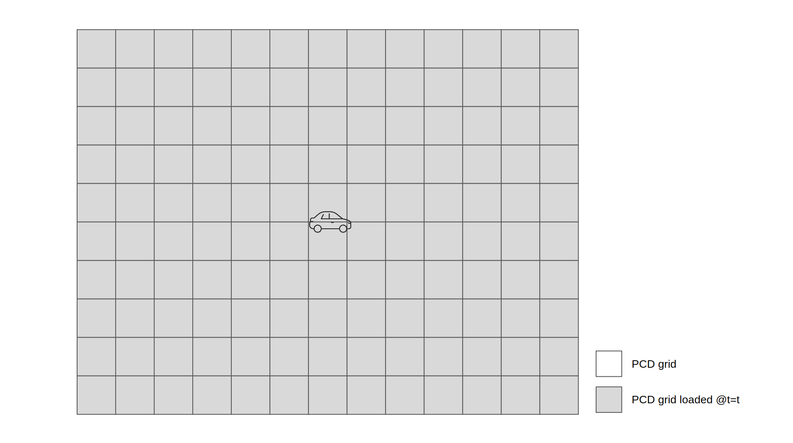
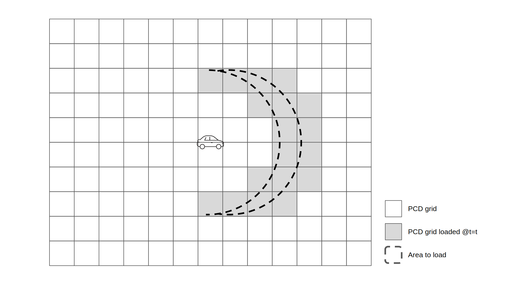

We, TIER IV, would like to propose a new architecture for point cloud map loading.

Goal: Expand the size limit of the point cloud maps to improve the scalability of Autoware

# Introduction
Current Autoware is not scalable in terms of the size of the map, since it loads the whole point cloud (PCD) map at once. As far as we know, the size limit of PCD map in the current Autoware is around 2GB which is determined by the maximum size of a topic message in cycloneDDS. Thus, we are working on a new type of algorithm for loading a PCD map: dynamic map loading (DML). 

https://user-images.githubusercontent.com/44218668/176372161-1db133ec-ec5c-460e-a678-ddbd38cbbd94.mp4

Through our experiment, however, it turned out that the current interface is not suitable for efficient DML. For example, the naive DML (shown in the above video) newly loads all the PCD maps within the range of 200m from the ego-vehicle every several seconds, which may be too inefficient to perform in real time on limited computational resources.

Thus, we propose a differential DML, which reuses the overlapped PCD grids from the previous loading area to reduce the computation. For example, in the case below, the naive DML loads 38 grids (shown in the gray area), while the differential DML loads 6 grids (shown in blue). Note that the differential DML has to remove 6 grids (shown in red) in this case. 

Unfortunately, the current map interface cannot provide sufficient information for client nodes to handle this complex management of PCD maps.
Thus, we, TIER IV, would like to propose to the AWF community a new interface to enable more flexible map loading.

Note that this is a proposal for an additional interface (service) as an option, and is not intended to remove any current interface.
Here we also assume that the PCD map is divided beforehand, e.g. into 20m x 20m grids (see [an additional proposal for map dividing format](./map_dividing_format.md)). 

# Possible map loading scenarios
Here we briefly introduce possible map loading scenarios.

## Whole map loading
This is the only scenario that the current Autoware supports, in which the client nodes load the whole available map at once.
Since the proposed architectures have no influence on the existing interface, you can perform whole map loading in the same way as in the current Autoware.

## Area loading
This scenario considers a case when a node (e.g. `pose_initializer`) only wants a limited area from the available PCD map. We assume that, given the area query, the node loads the PCD grids that overlap with the area query.

## Differential area loading
In this scenario, a node (e.g. `ndt_scan_matcher`) loads additional PCD grid maps (shown in blue) as well as removes maps that are no longer necessary (shown in red) at each step.
By reusing the maps that the node already has (shown in grey), the node can significantly reduce the computation that occurs in loading and preprocessing the map.

# Proposed architectures
We have two proposals, both of which have their pros and cons. We would like to ask for your opinions from various perspectives. 

## Proposal A: passing ids
The architecture of proposal A is shown below. A client that want to use the new interface ("`client 1`" in the example figure) first subscribes [autoware_map_msgs/msg/PCDMetaInfoArray](./autoware_map_msgs/msg/PCDMetaInfoArray.msg) that contains all the metadata of available PCD maps.
Using this information, the client selects the maps it wants and throw the query to the  `map_loader` with [autoware_map_msgs/srv/LoadPCDMaps](./autoware_map_msgs/srv/LoadPCDMaps.srv). `map_loader` loads the required maps and send them back as a response.

Note that in this case, we are also considering creating a library that covers all three scenarios mentioned above. 

### Pros:
- more simple than proposal B, and easier to understand

### Cons:
- unnecessarily too general to achieve the above-mentioned scenarios
- heavier implementation cost for the client side (which can be reduced by the library, but still requires a maintenance cost)

## Proposal B: passing area and map ids that the client already has
The architecture of proposal B is shown below. In this proposal, `client 1` sends the following two data as a query:
- mode (0: area loading, 1: differential area loading)
- the map area that the client wants (i.e. spherical area)

In addition, when the mode is set to differential area loading, `client 1` additionally sends the following query:
- map ids that `client 1` already has

The differential DML is expected to use this mode.
(See also: [autoware_map_msgs/srv/LoadPCDMapsGeneral](./autoware_map_msgs/srv/LoadPCDMapsGeneral.srv))

### Pros:
- necessary and sufficient for achieving the above-mentioned three scenarios (not too general)
- able to reduce the implementation cost of the client side

### Cons:
- complicated interface and thus more difficult to understand than proposal B

## Other candidates that we had in mind
See [here](./other_candidates.md)