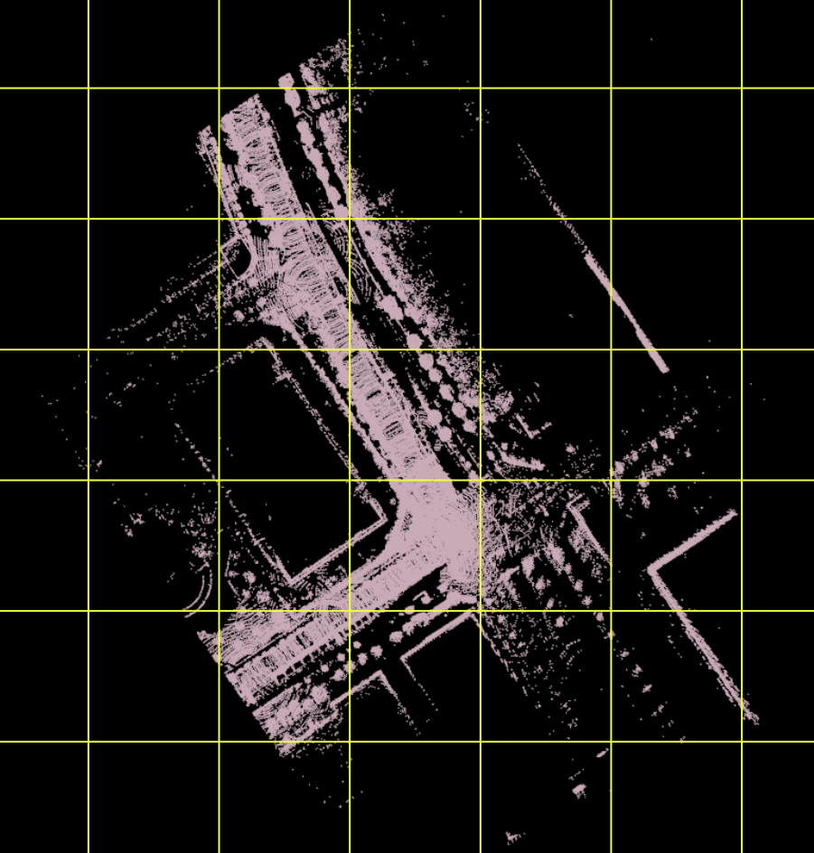

# An additional proposal for map dividing format
In addition to the new map loading interface, we would like to propose a map dividing format.

## Background
To scale up the Autoware towards a larger area ODD, it is necessary to load pointcloud maps dynamically onboard. In such a case, it is more convenient to pre-segment the map into a grid than to have one large pointcloud map. 
Current `pointcloud_map_loader` implementation in Autoware.universe supports multiple pointcloud maps file loading, but it does not define any prerequisites for how the division should be performed.
Introducing this requirement would simplify the implementation costs of dynamic map loading feature.

## Proposal
We would like to propose that the Autoware include the following prerequisite on the pointcloud map:
- The pointcloud map must be divided with xy-grid

Here, "divided with xy-grid" means that, given two monotonically increasing sequences $X=\lbrace x_0, x_1, \cdots, x_{m-1} \rbrace$ and $Y=\lbrace y_0, y_1, \cdots, y_{n-1} \rbrace$, any segmented map can be denoted as $x_i < x < x_{i+1}, y_j < y < y_{j+1}$.

By introducing this requirement, we can simplify the grid search algorithm. In calculating a set of map segments that have an overlap with the area query, which can be rephrased as a collision detection of two polygons, the search cost is dependent on the shape of the segments. Using a simple convex shape i.e. grid can significantly reduce the cost of implementation and computation.

Note that the proposal assumes that the map is not going to be segmented on z-axis. Considering the map segmentation based on z-axis may be necessary in the future (e.g. when applying the indoor mobile robots in an ODD with multiple floors), but the proposal does not include any requirement about z-axis-based segmentation, since we are not aware of the concrete use cases for now.

