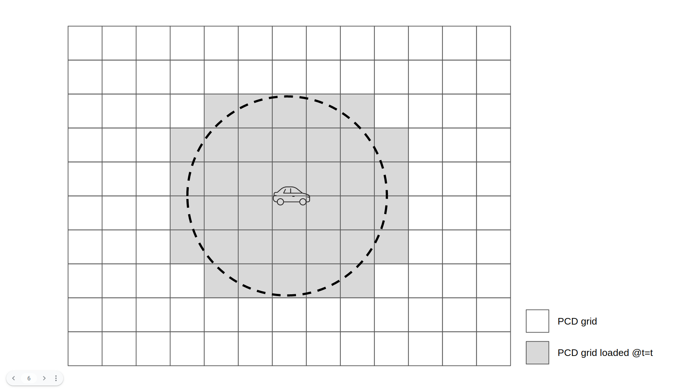

We, TIER IV, would like to propose a new architecture for point cloud map loading.

# Introduction
Current Autoware is not scalable in terms of the size of the map, since it loads the whole point cloud (PCD) map at once. As far as we know, the size limit of PCD map in the current Autoware is around 2GB, which is defined by the maximum size of topic message in cycloneDDS. Thus, we are working on a new type of algorithm for loading a PCD map: dynamic map loading (DML). 

https://user-images.githubusercontent.com/44218668/176372161-1db133ec-ec5c-460e-a678-ddbd38cbbd94.mp4

Through our experiment, however, it turned out that the current interface is not suitable for efficient DML. For example, our prototype DML (shown in the above video) newly loads all the PCD maps within the range of 200m from the ego-vehicle for every several seconds. This can be significantly improved by reusing the overlapped PCD grids from the previous loading area. 

Unfortunately, the current map interface cannot provide sufficient information for client nodes to handle this complex management of PCD maps.
Thus, we, TIER IV, would like to propose to the AWF community a new interface to enable more flexible map loading.

Note that this is a proposal for an additional interface (service) as an option, and is not intended to remove any current interface.
Here we also assume that the PCD map is divided beforehand, e.g. into 20m x 20m grids.

# Proposed architecture
The proposed architecture is shown below. A client that want to use the new interface ("client 1" in the example figure) first subscribes [autoware_map_msgs/msg/PCDMetaInfoArray](https://github.com/kminoda/autoware-map-loader-architecture-proposal/blob/main/autoware_map_msgs/msg/PCDMetaInfoArray.msg) that contains all the metadata of available PCD maps.
Using this information, the client selects the maps it wants and throw the query to the  `map_loader` with [autoware_map_msgs/srv/LoadPCDMaps](https://github.com/kminoda/autoware-map-loader-architecture-proposal/blob/main/autoware_map_msgs/srv/LoadPCDMaps.srv). `map_loader` loads the required maps and send them back as a response.

# Possible map loading scenarios
Here we briefly introduce possible map loading scenarios and how we can achieve them with the proposed architecture.

## Whole map loading
This is the only scenario that the current Autoware supports, in which the client nodes load the whole available map at once.
Since the new interface is just an optional one, you can 

## Area loading
In case you want to load specific area from the map,

## Differential area loading

As mentioned above, area loading is highly inefficient for DML, since the high load computation (SSD read, IO, ND voxelization) runs onboard.

Do note that this is different from area query. 

Given that we may need to load maps as efficient as possible to meet the limitaion of computational resources, we strongly believe that the new map architecture should support this type of query.

# Other architecture candidates
## Area-query, area-response
One of the other architectures we had in mind is this. 

### Pros
- Simple

### Cons
- Requires high computational complexity algorithm for extracting points within the designated area

## Area-query, grids-response

### Pros
- Fairly simple
- 

### Cons
- Still cannot support differential area loading ()